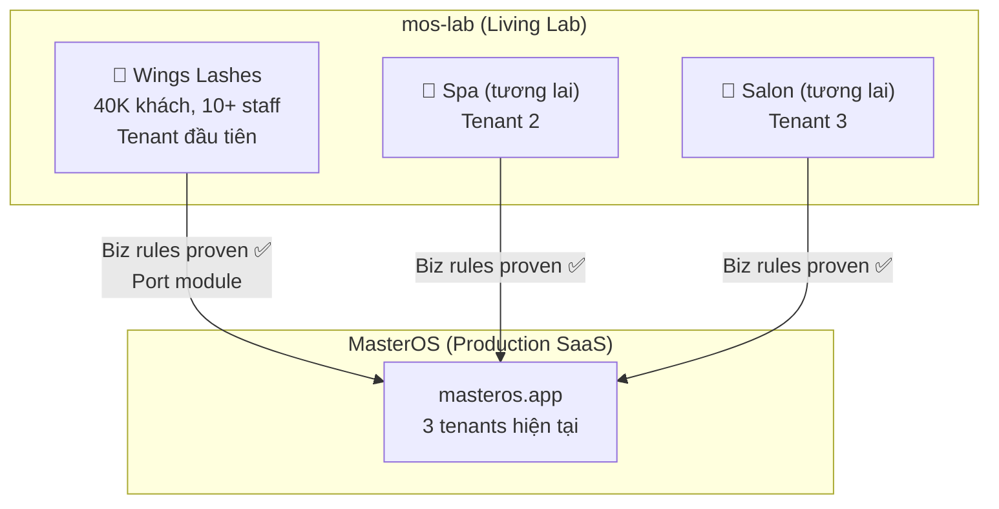
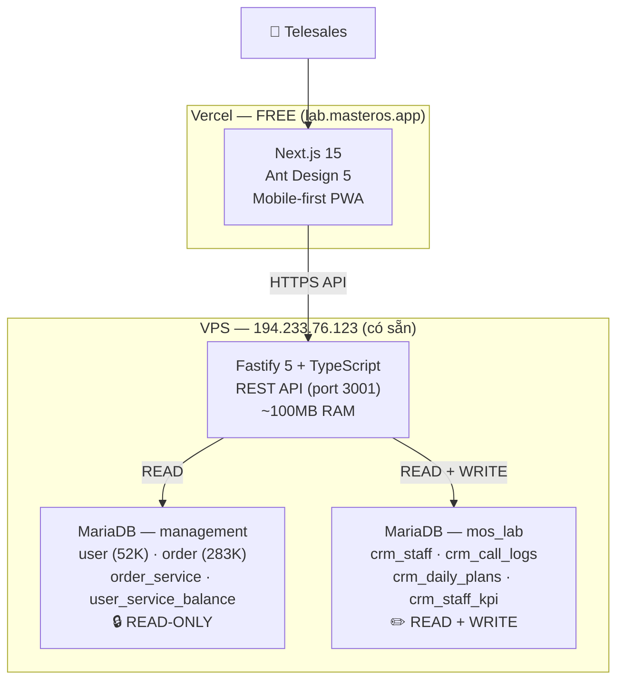

# 🚀 mos-lab — MasterOS Living Lab

> **Repo**: `mos-lab`
> **Domain**: `lab.masteros.app`
> **Strategy**: SpaceX approach — Build fast, launch, explode, learn, rebuild
> **Mục tiêu**: Tìm & prove business rules trên real business → port vào MasterOS

---

## 1. Tầm Nhìn



| Khái niệm           | Giải thích                                                                                          |
| :------------------ | :-------------------------------------------------------------------------------------------------- |
| **mos-lab**         | Phòng thí nghiệm sống cho MasterOS. Chạy business thật, test features mới                           |
| **Wings Lashes**    | Tenant đầu tiên — 40K khách, 10+ telesales, real revenue                                            |
| **Port → MasterOS** | Khi biz rules proven → đổi UI (Ant Design → Tailwind), đổi ORM (Prisma → Drizzle), giữ nguyên logic |
| **Tương lai**       | Thêm spa, salon làm tenant mới để test thêm biz rules cho ngành đó                                  |

---

## 2. Kiến Trúc



### Nguyên tắc an toàn:

- ✅ Fastify **chỉ ĐỌC** database legacy (`management`)
- ✅ Data CRM mới ghi vào database riêng (`mos_lab`)
- ✅ MySQL port 3306 **đóng kín** — chỉ Fastify (localhost) truy cập
- ✅ Legacy Wings Lashes web **không bị ảnh hưởng**

---

## 3. Tech Stack (AI-Optimized)

| Layer         | Công nghệ               | Tại sao                                       |
| :------------ | :---------------------- | :-------------------------------------------- |
| **UI**        | Ant Design 5            | AI viết ít code 3-5×, CRM components built-in |
| **Frontend**  | Next.js 15 (App Router) | Vercel native, SSR                            |
| **Backend**   | Fastify 5 + TypeScript  | Nhanh nhất, trên VPS, đọc MySQL trực tiếp     |
| **ORM**       | Prisma                  | `prisma db pull` auto-generate schema legacy  |
| **Database**  | MariaDB 10.3 (có sẵn)   | 0 setup, real-time data                       |
| **Auth**      | JWT + bcrypt            | Đơn giản, stateless                           |
| **Deploy FE** | Vercel (free)           | `git push` = deploy                           |
| **Deploy BE** | PM2 + SSH               | Auto-restart, cluster mode                    |
| **Monorepo**  | Turborepo + pnpm        | Shared types FE ↔ BE                          |
| **Runtime**   | Node.js 20 LTS          | Ổn định                                       |

### Khi port vào MasterOS:

| mos-lab (prototype) | →   | MasterOS (production)                |
| :------------------ | :-- | :----------------------------------- |
| Ant Design 5        | →   | Tailwind CSS v4 + MasterOS theme     |
| Prisma              | →   | Drizzle ORM                          |
| MariaDB (direct)    | →   | Supabase Postgres (sync)             |
| Fastify API         | →   | Next.js API Routes + `createRoute()` |
| **Biz rules**       | →   | **Copy 1:1 — không đổi**             |

---

## 4. Project Structure

```
mos-lab/
├── apps/
│   ├── web/                          # Next.js 15 + Ant Design
│   │   ├── app/
│   │   │   ├── (auth)/login/         # Login page
│   │   │   ├── (dashboard)/          # Layout chính
│   │   │   │   ├── customers/        # Danh sách khách, buckets
│   │   │   │   ├── plans/            # Daily plans
│   │   │   │   ├── calls/            # Call logs
│   │   │   │   └── kpi/              # KPI dashboard
│   │   │   └── layout.tsx
│   │   └── lib/                      # API client, hooks
│   │
│   └── api/                          # Fastify 5
│       ├── src/
│       │   ├── modules/
│       │   │   ├── auth/             # JWT login
│       │   │   ├── customers/        # READ legacy DB
│       │   │   ├── plans/            # Daily plans CRUD
│       │   │   ├── calls/            # Call logs CRUD
│       │   │   └── kpi/              # KPI queries
│       │   ├── prisma/
│       │   │   ├── legacy.prisma     # Auto-generated từ management DB
│       │   │   └── crm.prisma       # mos_lab schema
│       │   └── server.ts
│       └── package.json
│
├── packages/
│   └── shared/                       # Shared types & constants
│       ├── types/
│       └── constants/                # Buckets, roles, statuses
│
├── turbo.json
├── pnpm-workspace.yaml
└── package.json
```

---

## 5. Database

### `mos_lab` (MỚI — CRM data)

```sql
-- Staff accounts
CREATE TABLE crm_staff (
    id              INT AUTO_INCREMENT PRIMARY KEY,
    username        VARCHAR(50) UNIQUE NOT NULL,
    password_hash   VARCHAR(255) NOT NULL,
    display_name    VARCHAR(100) NOT NULL,
    role            VARCHAR(20) DEFAULT 'telesales',
    is_active       TINYINT(1) DEFAULT 1,
    created_at      DATETIME DEFAULT CURRENT_TIMESTAMP
);

-- Daily plans
CREATE TABLE crm_daily_plans (
    id              INT AUTO_INCREMENT PRIMARY KEY,
    legacy_user_id  INT NOT NULL,
    staff_id        INT NOT NULL,
    planned_date    DATE NOT NULL,
    bucket          VARCHAR(20),
    priority        INT DEFAULT 0,
    status          VARCHAR(20) DEFAULT 'PLANNED',
    created_at      DATETIME DEFAULT CURRENT_TIMESTAMP,
    UNIQUE KEY (legacy_user_id, planned_date)
);

-- Call logs
CREATE TABLE crm_call_logs (
    id              INT AUTO_INCREMENT PRIMARY KEY,
    plan_id         INT,
    legacy_user_id  INT NOT NULL,
    staff_id        INT NOT NULL,
    call_type       VARCHAR(20) NOT NULL,
    call_result     VARCHAR(20),
    duration_sec    INT,
    note            TEXT,
    outcome         VARCHAR(30),
    callback_date   DATE,
    created_at      DATETIME DEFAULT CURRENT_TIMESTAMP
);

-- KPI (auto-calculated)
CREATE TABLE crm_staff_kpi (
    id              INT AUTO_INCREMENT PRIMARY KEY,
    staff_id        INT NOT NULL,
    kpi_date        DATE NOT NULL,
    total_planned   INT DEFAULT 0,
    total_called    INT DEFAULT 0,
    total_answered  INT DEFAULT 0,
    total_booked    INT DEFAULT 0,
    total_renewed   INT DEFAULT 0,
    UNIQUE KEY (staff_id, kpi_date)
);
```

### `management` (Legacy — READ-ONLY)

```
Prisma sẽ tự generate schema bằng `prisma db pull`:
├── user              → Khách hàng
├── order             → Đơn hàng
├── order_service     → Dịch vụ
└── user_service_balance → Combo status
```

---

## 6. Bucket Logic (Biz Rule #1 — sẽ iterate)

```sql
SELECT
    u.id, u.name, u.phone,
    CASE
        WHEN usb.balance > 0 AND usb.expiry_date > CURDATE() THEN 'COMBO_LIVE'
        WHEN usb.id IS NOT NULL THEN 'COMBO_DEAD'
        ELSE 'SINGLE'
    END AS bucket
FROM management.user u
LEFT JOIN management.user_service_balance usb ON u.id = usb.user_id;
```

> [!NOTE]
> Đây là biz rule **v1** — sẽ thay đổi sau khi telesales dùng thử. Có thể cần thêm:
>
> - Sub-bucket "gần hết hạn" (< 7 ngày)
> - Sub-bucket "lâu không đến" (> 30 ngày)
> - Priority scoring dựa trên total_spent
> - VIP tier

---

## 7. Branding

| Element              | Value                                                       |
| :------------------- | :---------------------------------------------------------- |
| **Primary**          | Gold `#D4A84B`                                              |
| **Background**       | Black `#000000` / Dark `#1A1A1A`                            |
| **Logo**             | Wings Lashes logo (từ server)                               |
| **Ant Design theme** | `token.colorPrimary = '#D4A84B'`                            |
| **Bucket colors**    | 🟢 `#52C41A` Live · 🔴 `#FF4D4F` Dead · 🟡 `#FAAD14` Single |

---

## 8. Auth & Roles

| Role          | Xem khách | Gọi/Log | KPI team | Admin |
| :------------ | :-------- | :------ | :------- | :---- |
| **telesales** | ✅        | ✅      | ❌       | ❌    |
| **manager**   | ✅        | ✅      | ✅       | ❌    |
| **admin**     | ✅        | ✅      | ✅       | ✅    |

Accounts ban đầu: **10+ telesales** + 1 admin

---

## 9. API Endpoints

### Customers (READ từ legacy)

| Method | Endpoint                     | Chức năng                        |
| :----- | :--------------------------- | :------------------------------- |
| GET    | `/api/customers`             | List + filter by bucket + search |
| GET    | `/api/customers/:id`         | Chi tiết 1 khách                 |
| GET    | `/api/customers/:id/history` | Lịch sử đơn hàng                 |
| GET    | `/api/customers/stats`       | Count per bucket                 |

### CRM (READ + WRITE vào mos_lab)

| Method | Endpoint                 | Chức năng                 |
| :----- | :----------------------- | :------------------------ |
| POST   | `/api/plans`             | Tạo daily plan            |
| GET    | `/api/plans/today`       | Plan hôm nay              |
| PUT    | `/api/plans/:id`         | Update status             |
| POST   | `/api/calls`             | Ghi log cuộc gọi          |
| GET    | `/api/calls/:customerId` | Lịch sử gọi               |
| GET    | `/api/kpi/today`         | KPI hôm nay               |
| GET    | `/api/kpi/report`        | KPI theo khoảng thời gian |

### Auth

| Method | Endpoint            | Chức năng     |
| :----- | :------------------ | :------------ |
| POST   | `/api/auth/login`   | Login → JWT   |
| POST   | `/api/auth/refresh` | Refresh token |
| GET    | `/api/auth/me`      | Current user  |

---

## 10. Timeline — SpaceX Approach

```
Day 1 ──→ Setup repo + Fastify + prisma db pull
Day 2 ──→ Auth + Customer list + Bucket logic
Day 3 ──→ Call logging + Daily plan
Day 4 ──→ KPI dashboard + Polish
Day 5 ──→ 🚀 LAUNCH — Telesales dùng thật
Day 6+ ──→ 💥 Iterate biz rules cho đến khi proven
          ──→ Port vào MasterOS khi stable
```

---

## 11. Tóm Tắt Quyết Định

| Quyết định         | Kết luận                                      |
| :----------------- | :-------------------------------------------- |
| **Project**        | `mos-lab` (MasterOS Living Lab)               |
| **Domain**         | `lab.masteros.app`                            |
| **Repo**           | GitHub mới, tách khỏi WingsApp                |
| **Local**          | `~/projects/mos-lab`                          |
| **Strategy**       | SpaceX — build fast, test real, iterate       |
| **First tenant**   | Wings Lashes (40K khách)                      |
| **Tech stack**     | Ant Design + Prisma + Fastify + MariaDB       |
| **Dùng để**        | Tìm & prove biz rules                         |
| **Sau khi proven** | Port vào MasterOS (đổi UI/ORM, giữ biz logic) |
| **Chi phí thêm**   | 0đ/tháng                                      |

---

## 12. Tài liệu & Tích hợp (Wiki)

Hệ thống tích hợp các dịch vụ bên thứ ba và tài liệu hướng dẫn vận hành chi tiết:

- [Tài liệu cấu hình & biểu phí OmiCall](file:///Users/dannydo/projects/mos-lab/docs/wiki/omicall_reference.md) — Chi tiết về các đầu số hotline mạng Viettel, cơ chế định tuyến, chính sách chặn cuộc gọi, cảnh báo số dư tài khoản và biểu phí cước gọi di động/cố định/1800.
