# 🎙️ Antigravity & Hột Mít (VoicePilot) Voice System Architecture

Tài liệu này là **Nguồn sự thật duy nhất (Single Source of Truth - SSOT)** về toàn bộ kiến trúc hệ thống âm thanh, nhận diện giọng nói, phím tắt toàn cục và quản lý tiến trình chạy nền của bộ đôi **Antigravity IDE** và trợ lý **Hột Mít (VoicePilot)** trên macOS.

---

## 🗺️ 1. Bản đồ Dịch vụ Nền & Quản lý Mục Đăng nhập (Background Services Map)

Tất cả các thành phần nền đều được quản lý thống nhất qua `launchd` (`~/Library/LaunchAgents/`) với tên hiển thị trực quan, phân định rõ chức năng trong **Cài đặt hệ thống (System Settings > Login Items & Allow in the Background)**:

| Tên hiển thị (BTM Name)               |  Loại hình   | Đường dẫn thực thi (Executable Path)                                                                           | Tệp cấu hình Plist                          | Tệp Nhật ký (Log)                                    |             Phím tắt / Kích hoạt              | Nhiệm vụ chính                                                                                                   |
| :------------------------------------ | :----------: | :------------------------------------------------------------------------------------------------------------- | :------------------------------------------ | :--------------------------------------------------- | :-------------------------------------------: | :--------------------------------------------------------------------------------------------------------------- |
| **`Antigravity Voice Chat`**          | Swift Binary | `~/.gemini/antigravity/bin/Antigravity Voice Chat`<br>_(symlink ➔ `double-control-listener`)_                  | `com.antigravity.double-control.plist`      | `~/.gemini/antigravity/daemon/double-control.log`    |           **Gõ đúp Control (`⌃⌃`)**           | Bắt sự kiện phím toàn cục, tự động chuyển cửa sổ về Antigravity IDE và gửi `Control + M` để ghi âm rảnh tay.     |
| **`VoicePilot HUD Overlay`**          |  Cocoa App   | `~/.gemini/antigravity/bin/VoicePilot HUD Overlay`<br>_(symlink ➔ `VoicePilot.app/Contents/MacOS/VoicePilot`)_ | `com.antigravity.voice-pilot-ui.plist`      | `~/.gemini/antigravity/logs/voice-pilot-ui.log`      |          Tự khởi chạy khi đăng nhập           | Cửa sổ HUD trong suốt nổi trên màn hình, hiển thị trạng thái nghe/nói, waveform âm thanh và nội dung AI trả lời. |
| **`VoicePilot Mic Toggle`**           | Swift Binary | `~/.gemini/antigravity/bin/VoicePilot Mic Toggle`<br>_(symlink ➔ `double-fn-listener`)_                        | `com.antigravity.double-fn.plist`           | Chạy nền im lặng (âm thanh `Tink`/`Morse`)           | **Gõ đúp Option (`⌥⌥`)<br>hoặc Fn (`fn fn`)** | Bật/tắt nhanh micro của trợ lý Hột Mít, thông báo bằng âm thanh và cập nhật trạng thái lên HUD.                  |
| **`VoicePilot Core Daemon`**          |   Node.js    | `~/.gemini/antigravity/bin/VoicePilot Core Daemon`<br>_(script ➔ `live-daemon.js`)_                            | `com.antigravity.voice-pilot.plist`         | `~/.gemini/antigravity/logs/voice-pilot.log`         |          Tự khởi chạy khi đăng nhập           | Bộ não xử lý STT (Whisper/Gemini Live), điều phối luồng âm thanh và tương tác AI của Hột Mít.                    |
| **`Antigravity Nightly Maintenance`** |  Bash Cron   | `~/.gemini/antigravity/bin/Antigravity Nightly Maintenance`<br>_(script ➔ `nightly-maintenance`)_              | `com.antigravity.nightly-maintenance.plist` | `~/.gemini/antigravity/logs/nightly-maintenance.log` |           Chạy tự động lúc 03:00 AM           | Dọn dẹp log cũ, thu hoạch từ điển ngữ âm và tối ưu hóa hệ thống.                                                 |

---

## 🔒 2. Cơ chế Chống Xung đột & Trọng tài Độc quyền (Mutex & Anti-Clashing Architecture)

Hệ thống thiết lập 3 tầng bảo vệ để đảm bảo **tính ổn định tuyệt đối**:

```mermaid
flowchart TD
    subgraph SingleInstance["1. Single Instance Protection (flock)"]
        A[LaunchAgent / App khởi động] --> B{Kiểm tra flock kernel}
        B -- "Đã có tiến trình chạy" --> C[Thoát ngay lập tức exit 0]
        B -- "Chưa có tiến trình" --> D[Chiếm giữ lock file & Khởi chạy]
    end

    subgraph HardwareHandoff["2. Microphone Hardware Handoff"]
        E[Người dùng gõ đúp Control ⌃⌃] --> F[Kill voice-streamer]
        F --> G[Tạo lock /tmp/voice_pilot_muted.lock]
        G --> H[Phần cứng Mic giải phóng 100% cho Antigravity]
        H --> I[Chuyển cửa sổ & Gửi Control + M]
        I --> J[Gõ ⌃⌃ lần nữa để kết thúc]
        J --> K[Xoá lock file & Bật lại Mic Hột Mít]
    end

    subgraph VoiceArbitration["3. Audio Output Arbitration (Barge-in)"]
        L[Agent gọi speak script] --> M[pkill -9 afplay.*antigravity_speech]
        M --> N[Phát âm thanh mới bằng giọng Siri Neural macOS 27]
    end
```



### 2.1. Đảm bảo Duy nhất 1 Phiên bản (Kernel `flock`)

- Cả `VoicePilot.swift`, `double-control-listener.swift`, và `double-fn-listener.swift` đều tích hợp `flock(lockFile, LOCK_EX | LOCK_NB)` ngay ở dòng đầu tiên của `main`.
- Khi có một instance đang chạy, bất kỳ lệnh gọi bổ sung nào (từ script, terminal hoặc launchd) sẽ lập tức thoát an toàn với mã `0`, triệt tiêu hoàn toàn hiện tượng nhân bản cửa sổ hay tranh chấp sự kiện phím.

### 2.2. Bàn giao Phần cứng Microphone (CoreAudio Hardware Handoff)

- Trợ lý Hột Mít sử dụng tiến trình `voice-streamer` để nghe liên tục.
- Khi người dùng muốn nói chuyện với **Antigravity** (`⌃⌃`):
  1. `double-control-listener` ngay lập tức thực hiện `pkill -9 -f voice-streamer`.
  2. Ghi cờ khóa `/tmp/voice_pilot_muted.lock` và `/tmp/antigravity_speaking.lock`.
  3. Đợi 300ms để CoreAudio giải phóng hoàn toàn thiết bị microphone cho Chromium/Antigravity.
  4. Gửi phím `Control + M` kích hoạt ghi âm của Antigravity.
  5. Khi kết thúc, nhả cờ khóa để Hột Mít tự động kích hoạt micro trở lại.

### 2.3. Chống Đè Giọng Nói (Barge-in Mutual Exclusion)

- Mọi lệnh phát âm thanh giọng nói qua script `~/.gemini/antigravity/bin/speak` tự động ngắt bất kỳ tiến trình âm thanh `afplay` nào đang phát dở trước khi đọc câu mới.
- Không bao giờ xảy ra tình trạng 2 giọng đọc nói chồng lên nhau. Giọng đọc chuẩn mặc định toàn hệ thống là **Apple Siri Neural 48kHz của macOS 27** (chạy offline 100% trên chip Apple Silicon).

---

## 🪟 3. Cơ chế Chuyển Cửa sổ & Gửi Phím Tin Cậy (Focus & Keystroke Pipeline)

### 3.1. Chuyển Tiêu điểm Cửa sổ trên macOS Sequoia & macOS 27

- **Vấn đề**: Các bản macOS mới chặn phương thức `app.activate()` truyền thống của AppKit nếu gọi từ tiến trình nền và người dùng đang ở ứng dụng khác (`ignoringOtherApps is deprecated in macOS 14`).
- **Giải pháp**:
  ```swift
  // 1. Kích hoạt qua LaunchServices (bắt buộc macOS chuyển giao diện)
  let p = Process()
  p.executableURL = URL(fileURLWithPath: "/usr/bin/open")
  p.arguments = ["-a", "Antigravity"]
  try? p.run()
  p.waitUntilExit()

  // 2. Kích hoạt đa lớp qua NSWorkspace
  for app in agApps {
      app.activate(options: [.activateIgnoringOtherApps, .activateAllWindows])
  }
  ```

### 3.2. Điều khiển Ghi âm Trực tiếp qua Chrome DevTools Protocol (CDP State-Driven Pipeline)

- Thay vì gửi phím mù (`Control + M`) dễ bị giật hoặc sai trạng thái, daemon sử dụng kênh CDP WebSocket thông qua script `toggle-antigravity-mic`:
  1. **Đọc cổng kết nối**: Lấy cổng DevTools từ `~/Library/Application Support/Antigravity/DevToolsActivePort`.
  2. **Kiểm tra trạng thái DOM thực tế**: Kiểm tra `button[data-tooltip-id="input-send-button-record-tooltip"]` với `aria-label` ("Record voice memo" vs "Stop recording").
  3. **Thực thi chính xác theo cờ lệnh**:
     - `start`: Chỉ click nếu đang không ghi âm, chờ DOM xác nhận `isRecording: true`.
     - `stop`: Chỉ click nếu đang ghi âm, chờ DOM xác nhận `isRecording: false`.
     - `status`: Truy vấn trạng thái DOM hiện tại mà không thực hiện click.
  4. **Watchdog tự phục hồi (Self-healing State Sync)**: Khi đang ở chế độ ghi âm (`isDictating == true`), daemon định kỳ mỗi 1.0 giây kiểm tra DOM. Nếu người dùng click chuột dừng lại, gửi câu lệnh, hoặc Antigravity tự ngắt do im lặng (VAD), daemon lập tức phát hiện `isRecording == false`, tự động giải phóng cờ khóa và kích hoạt micro Hột Mít trở lại mà không bao giờ bị lệch trạng thái (zero desync).

---

## 🛡️ 4. Phân quyền Hệ thống macOS (TCC & Accessibility Runbook)

Để các tiến trình nền có thể tổng hợp phím và kiểm soát giao diện:

1. **Quyền Trợ năng (Accessibility)**:
   - Đường dẫn: **Cài đặt hệ thống ➔ Quyền riêng tư & Bảo mật ➔ Trợ năng (Accessibility)**.
   - Các mục cần được cấp quyền (gạt bật công tắc):
     - `Antigravity Voice Chat` (hoặc `double-control-listener`)
     - `VoicePilot (Hột Mít HUD)`
     - `Antigravity.app`
2. **Quyền Mục chạy nền (Login Items & Extensions)**:
   - Đường dẫn: **Cài đặt hệ thống ➔ Cài đặt chung ➔ Mục đăng nhập (Login Items)**.
   - Mục **Cho phép trong nền (Allow in the Background)**:
     - Đảm bảo các mục: `Antigravity Voice Chat`, `VoicePilot HUD Overlay`, `VoicePilot Mic Toggle`, `VoicePilot Core Daemon`, `Antigravity Nightly Maintenance` đều được bật (ON).

---

## 🛠️ 5. Sổ tay Vận hành & Lệnh Điều khiển Nhanh (Operational Cheatsheet)

### 5.1. Biên dịch lại các thành phần Native Swift

```bash
# 1. Biên dịch bộ lắng nghe đúp Control (Antigravity Voice Chat)
DEVELOPER_DIR=/Library/Developer/CommandLineTools swiftc -O   ~/.gemini/antigravity/bin/double-control-listener.swift   -o ~/.gemini/antigravity/bin/double-control-listener

# 2. Biên dịch bộ lắng nghe đúp Option/Fn (VoicePilot Mic Toggle)
DEVELOPER_DIR=/Library/Developer/CommandLineTools swiftc -O   ~/.gemini/antigravity/bin/double-fn-listener.swift   -o ~/.gemini/antigravity/bin/double-fn-listener

# 3. Biên dịch Giao diện Hột Mít HUD Overlay
DEVELOPER_DIR=/Library/Developer/CommandLineTools swiftc -O   ~/.gemini/antigravity/src/voice-pilot/VoicePilot.swift   -o ~/.gemini/antigravity/bin/VoicePilot
cp ~/.gemini/antigravity/bin/VoicePilot ~/Applications/VoicePilot.app/Contents/MacOS/VoicePilot
```

### 5.2. Khởi động lại các Dịch vụ Nền

```bash
# Nạp lại toàn bộ hệ sinh thái âm thanh
launchctl unload ~/Library/LaunchAgents/com.antigravity.double-control.plist 2>/dev/null || true
launchctl unload ~/Library/LaunchAgents/com.antigravity.double-fn.plist 2>/dev/null || true
launchctl unload ~/Library/LaunchAgents/com.antigravity.voice-pilot-ui.plist 2>/dev/null || true
launchctl unload ~/Library/LaunchAgents/com.antigravity.voice-pilot.plist 2>/dev/null || true

pkill -9 -f "VoicePilot" || true
pkill -9 -f "double-control-listener" || true
pkill -9 -f "double-fn-listener" || true

launchctl load ~/Library/LaunchAgents/com.antigravity.double-control.plist
launchctl load ~/Library/LaunchAgents/com.antigravity.double-fn.plist
launchctl load ~/Library/LaunchAgents/com.antigravity.voice-pilot-ui.plist
launchctl load ~/Library/LaunchAgents/com.antigravity.voice-pilot.plist
```

### 5.3. Kiểm tra Nhật ký Thời gian thực (Real-time Log Monitoring)

```bash
# Xem log phím đúp Control
tail -f ~/.gemini/antigravity/daemon/double-control.log

# Xem log Hột Mít HUD UI
tail -f ~/.gemini/antigravity/logs/voice-pilot-ui.log

# Xem log Hột Mít Core Daemon (Node.js)
tail -f ~/.gemini/antigravity/logs/voice-pilot.log
```

---

## 📁 6. Cây Thư mục Lưu trữ Mã nguồn & Cấu hình

```
~/.gemini/antigravity/
├── bin/                                # Thư mục binary & symlink chuẩn hóa
│   ├── Antigravity Voice Chat          # Symlink ➔ double-control-listener
│   ├── double-control-listener.swift   # Mã nguồn bộ lắng nghe đúp Control
│   ├── VoicePilot HUD Overlay          # Symlink ➔ VoicePilot.app binary
│   ├── VoicePilot Mic Toggle           # Symlink ➔ double-fn-listener
│   ├── double-fn-listener.swift        # Mã nguồn bộ lắng nghe đúp Option/Fn
│   ├── VoicePilot Core Daemon          # Script chạy live-daemon.js
│   └── speak                           # Binary phát âm thanh TTS Siri Neural macOS 27
├── src/voice-pilot/
│   ├── VoicePilot.swift                # Mã nguồn giao diện nổi Hột Mít (Cocoa HUD)
│   ├── live-daemon.js                  # Engine trung tâm xử lý STT & AI
│   └── local-engine.js                 # Fallback engine (macOS 27 Apple Intelligence)
└── daemon/ & logs/                     # Toàn bộ file log hệ thống

~/Library/LaunchAgents/
├── com.antigravity.double-control.plist
├── com.antigravity.double-fn.plist
├── com.antigravity.voice-pilot-ui.plist
├── com.antigravity.voice-pilot.plist
└── com.antigravity.nightly-maintenance.plist

~/Applications/
└── VoicePilot.app/                     # Ứng dụng macOS chuẩn hóa cho Hột Mít HUD
```
