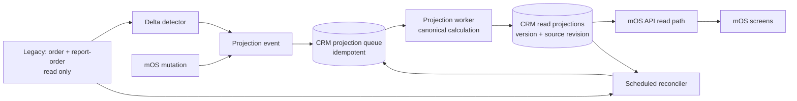

# mOS Snapshot / Projection System

## Mục tiêu

Giữ các màn đọc nhiều phản ánh dữ liệu Live nhưng không phải tính lại toàn bộ lịch sử mỗi request. Đây là **projection bền vững**, không phải cache TTL đơn thuần.

Ngân sách ban đầu:

| Loại trải nghiệm    | Mục tiêu                          |
| ------------------- | --------------------------------- |
| Query tương tác     | p95 < 0,5 giây                    |
| Trang hoàn chỉnh    | 1–2 giây                          |
| Snapshot lệch nguồn | 0 bản ghi sau đối soát thành công |

Phạm vi ban đầu là mOS API và CRM database. **Không đọc/ghi/sửa/deploy Wings Control.** Legacy `management` chỉ được đọc.

## Feature contract

| Hạng mục     | Quy ước                                                                                                     |
| ------------ | ----------------------------------------------------------------------------------------------------------- |
| Outcome      | Campaign, CRM và KPI đọc dữ liệu dẫn xuất nhanh mà vẫn truy vết được nguồn Live.                            |
| Người dùng   | Các màn mOS hiện hữu chỉ đọc projection; admin/worker vận hành backfill và đối soát.                        |
| Owner        | `ProjectionService` trong mOS API là nơi duy nhất tính và ghi projection.                                   |
| Nguồn thật   | Legacy order/report-order và CRM domain records; không sao chép logic vào frontend.                         |
| Quyền ghi    | Chỉ mOS worker ghi CRM projection; không ghi bảng giao dịch Legacy.                                         |
| Tính đúng    | Mỗi row lưu phiên bản công thức, revision nguồn, thời điểm tính và dấu vết đối chiếu.                       |
| Fallback     | Nếu projection thiếu/stale: enqueue rebuild, API dùng query gốc có giới hạn; không trả dữ liệu cũ im lặng.  |
| UI           | API trả `freshness`/`asOf` để màn hình có thể hiện trạng thái đồng bộ; frontend không tự tính số liệu.      |
| Verification | Hash projection so với query chuẩn, idempotency, retry, backfill, out-of-order event, và browser/API smoke. |

## Kiến trúc

### Ba đường cập nhật

1. **Event trực tiếp** — khi chính mOS thay đổi dữ liệu nguồn mà nó sở hữu, cùng transaction ghi một event nhỏ.
2. **Delta detector** — với Legacy, worker chỉ-đọc quét watermark tăng dần (`updated_at`/`date_modified`, hoặc cursor theo order/report-order) rồi enqueue đúng khách/bản ghi bị ảnh hưởng.
3. **Reconciliation** — job định kỳ tính lại mẫu hoặc toàn bộ partition, so với projection. Mismatch tạo event rebuild và ghi audit; không tự che lỗi bằng TTL.

Event có `projectionKey`, `entityKey`, `sourceRevision`, `reason`, `formulaVersion` và idempotency key. Worker chỉ ghi nếu revision mới hơn; event đến đảo thứ tự hay retry không làm dữ liệu lùi về bản cũ.

## Dữ liệu dùng chung

Các bảng CRM được đề xuất, tạo qua migration riêng sau khi prototype đạt benchmark:

| Bảng                            | Vai trò                                       | Khoá chính                            |
| ------------------------------- | --------------------------------------------- | ------------------------------------- |
| `crm_projection_jobs`           | Outbox/queue bền vững, retry và lease worker  | projection + entity + source revision |
| `crm_projection_runs`           | Audit backfill/reconcile, số đọc/ghi/mismatch | run id                                |
| `crm_projection_watermarks`     | Cursor an toàn cho từng Legacy detector       | source + partition                    |
| `crm_customer_visit_projection` | First projection: last visit chuẩn theo khách | legacy user id                        |

Mỗi row projection tối thiểu có:

- giá trị dẫn xuất, ví dụ `lastVisitAt` và `daysSinceLastVisit`;
- `sourceRevision` và `formulaVersion`;
- `computedAt`, `reconciledAt`, `status` (`FRESH`, `PENDING`, `STALE`, `FAILED`);
- checksum của input chuẩn, không lưu dữ liệu khách không cần thiết trong log.

Không dùng bảng `user_profile.last_order_booking` làm nguồn chuẩn: Orb đã chứng minh nó sai kết quả cho một số khách. Nó chỉ có thể là tín hiệu phát hiện thay đổi, không phải truth.

## Projection đầu tiên: Customer Last Visit

Đây là candidate đầu tiên vì campaign customers từng có mẫu aggregate lịch sử vượt ngân sách. Công thức chuẩn giữ nguyên rule hiện tại:

- chỉ order `Completed`;
- ngày visit là `COALESCE(report_order.actual_booking_date_start, order.booking_date_start)`;
- lấy ngày lớn nhất của mỗi khách;
- `daysSinceLastVisit` tính tại read-time từ `lastVisitAt` theo timezone mOS, để qua nửa đêm không phải rebuild toàn bộ khách.

Read path của Campaign customers sẽ bulk-read projection theo danh sách khách của trang. Chỉ các projection thiếu/stale được enqueue; response vẫn dùng canonical fallback cho đúng các bản ghi đó và gắn trạng thái freshness. Khi coverage đạt 100% và reconcile sạch, có thể bật projection-only qua feature flag có rollback.

## Quy tắc chọn candidate tiếp theo

Projection chỉ dùng khi tất cả điều kiện sau đúng:

1. Dữ liệu là dẫn xuất, đọc nhiều và deterministic.
2. Query/index/rewrite đã được benchmark trên Orb nhưng vẫn không đạt p95 dưới 0,5 giây.
3. Khoá invalidation rõ ràng: biết thay đổi nào ảnh hưởng row nào.
4. Canonical calculation và đối soát tự động có thể thực hiện.
5. Số liệu không phải ad-hoc search tự do hoặc export với filter bất kỳ.

Phù hợp: last visit, balance, customer summary, KPI theo ngày/nhân sự. Không dùng mặc định cho: full-text customer search, export ad-hoc, hoặc query có filter mở không thể invalidation chính xác.

## Lộ trình triển khai an toàn

| Giai đoạn           | Deliverable                                                | Gate để đi tiếp                          |
| ------------------- | ---------------------------------------------------------- | ---------------------------------------- |
| 0. Contract         | DTO, formula/version, ownership và nguồn change            | Review xác nhận semantics Last Visit     |
| 1. Shadow build     | Migration CRM, queue, worker, backfill chỉ ghi projection  | Hash 100% khớp query chuẩn trên Orb      |
| 2. Shadow read      | API đọc cả canonical + projection, chỉ đo mismatch/latency | 0 mismatch qua nhiều lần reconcile       |
| 3. Controlled read  | Feature flag dùng projection cho Campaign customers        | p95 <0,5 s, fallback/retry được test     |
| 4. Production guard | Guarded deploy, health + revision + queue/lag dashboard    | Không stale row, rollback flag hoạt động |
| 5. Reuse            | Đăng ký candidate mới theo rule trên                       | Không duplicate business logic           |

## Kiểm thử bắt buộc

- Unit: canonical calculator, formula version, source-revision ordering, idempotency.
- Integration: retry, concurrent duplicate jobs, event đến trễ, lease timeout, rebuild partition.
- Data parity: hash tất cả khách trong sample lớn; test khách không có visit, đổi booking date, hoàn đơn/đổi trạng thái, actual check-in đổi.
- Reconciliation: cố tình làm stale một row ở Orb, chứng minh detector/reconciler tự đưa về đúng giá trị.
- Performance: 30 lượt warm benchmark, p50/p95/p99, rows examined và fallback rate.
- Release: migration CRM tách riêng, guarded deploy, API health/revision, feature-flag rollback không cần restart.

## Không làm trong phase đầu

- Không cache toàn response theo TTL rồi coi là dữ liệu Live.
- Không ghi vào Legacy hoặc Wings Control.
- Không dùng snapshot cho mọi query.
- Không bỏ canonical query trước khi có parity và reconciliation evidence.

## Phase 1 implementation status

Đã xây cục bộ, chưa commit hoặc deploy:

| Thành phần            | Trạng thái | Ghi chú                                                                                    |
| --------------------- | ---------- | ------------------------------------------------------------------------------------------ |
| CRM migration         | Đạt        | Thêm customer-visit projection và durable job queue; đã apply trên Orb.                    |
| Canonical calculator  | Đạt        | Giữ nguyên `Completed` + `COALESCE(MAX(actual), MAX(booking))`.                            |
| Campaign read path    | Đạt        | Đọc snapshot trước; canonical fallback chỉ cho các customer chưa có snapshot.              |
| Queue/worker          | Đạt        | Job coalesce theo customer, lease/retry, xử lý theo batch để không N+1 aggregate.          |
| Legacy detector       | Đạt        | Chỉ đọc `order.date_updated`; rebuild các customer vừa thay đổi.                           |
| Reconciliation        | Đạt        | Enqueue lại active campaign customers theo chu kỳ để tự sửa lệch.                          |
| Production enablement | Chưa làm   | Worker và read path đều mặc định tắt; cần migration + shadow parity review + feature gate. |

**Proof Orb:** 3 customer campaign được đọc bằng canonical fallback, enqueue, xử lý batch, sau đó đọc `FRESH` projection; `lastVisitAt` khớp hoàn toàn ở cả ba. Unit tests cũng xác nhận timezone ngày mOS và source revision.

**Benchmark Orb lớn nhất:** 1.855 customer, hash `lastVisitAt` khớp toàn bộ. Query aggregate chuẩn p95 **323 ms**; snapshot read p95 **53 ms** (30 lượt warm). Đây là benchmark cho riêng Last Visit enrichment, không phải toàn bộ response Campaign customers.
